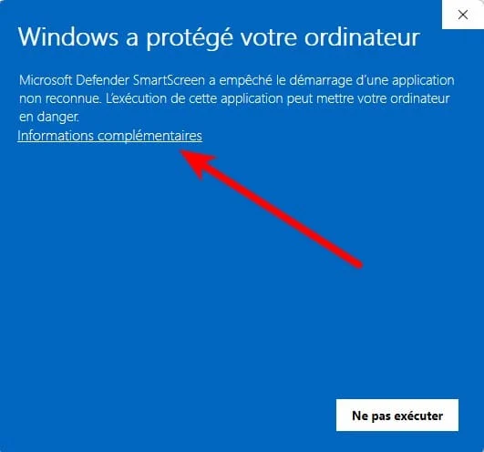
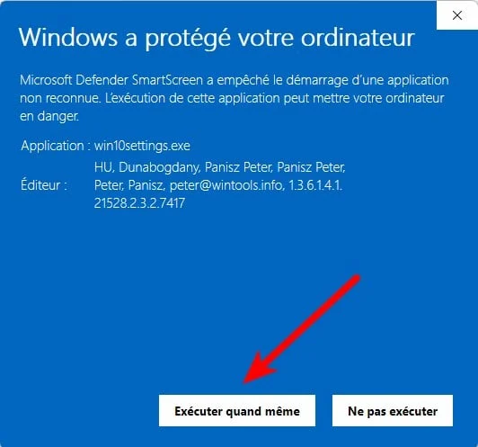
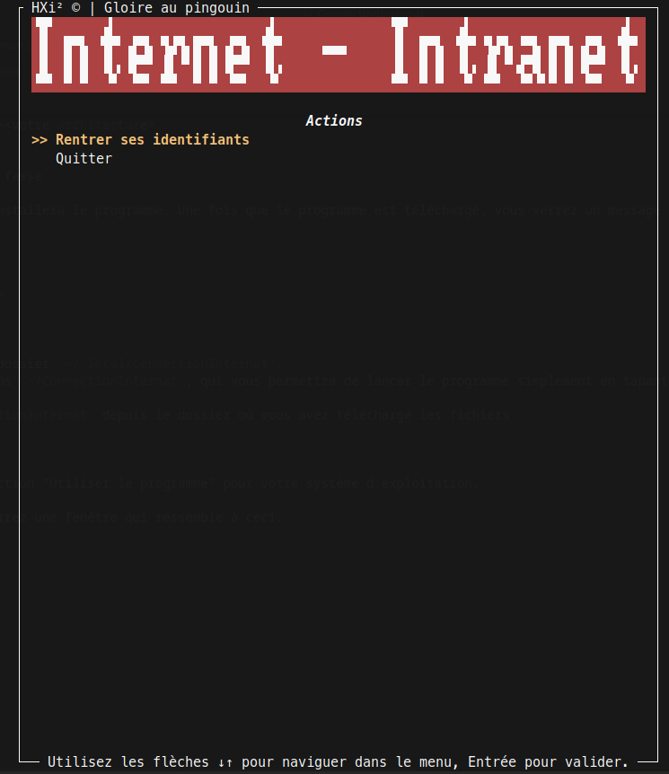

# ConnectionInternat

Ce programme a comme but de se connecter au réseau interne de l'internat du Lycée du Parc. Ce réseau est ancien, géré par [ucopia](https://ucopia.com/en/) (on doit se rendre sur le site `controller.access.network`) pour s'identifier au réseau.

L'ancienneté de ce réseau fait qu'il est impossible de se connecter avec un appareil récent à moins d'utiliser une vieille version d'un navigateur, qui supportera TLSv1.0. Non seulement cela, mais il faut garder la page ouverte pendant toute la durée de sa connexion, ce qui peut etre contraignant étant donné que les navigateurs modernes ferment les onglets inutilisés.

De plus, l'ancienneté du certificat et de la méthode de cryptage de celui-ci nous mets dans l'impossibilité de faire un programme très simple pour s'y connecter.

Ainsi, nous avons créé ce logiciel, qui possède une interface graphique, pour se connecter au réseau interne de l'internat du Lycée du Parc. Il suffira de le lancer et de le garder ouvert, et il se connectera automatiquement au réseau, gardant la connection active.

Note: si vous venez d'une autre école, ou chose similaire, et que vous voulez qu'on travaille pour l'adapter à votre réseau, n'hésitez pas à nous contacter, à travers une issue sur ce repo, ou un mail à l'adresse dans la description de @itsvyle.

## Installation

Le logiciel est pour l'instant compatible avec Linux et Windows. Le support mac est possible et pourra etre implémenté, cependant nous n'avons pas de mac pour tester et ainsi n'avons pas pu le finir - si vous avez un mac et que vous voulez utiliser l'application, n'hésitez pas à nous contacter, par un mail à l'adresse dans la description de @itsvyle.

### Windows

Requiert windows 10 ou plus récent; on ne peut pas garantir le fonctionnement sur des versions plus anciennes.

<details>
  <summary>Instructions pour télécharger sur Windows</summary>

## 1. Télécharger l'installeur

Cliquer ici pour télécharger l'installeur: [installer-ConnectionInternat-windows.exe](https://github.com/ntillier/ConnectionInternat/releases/latest/download/installer-ConnectionInternat-windows.exe)

## 2. Exécuter l'installeur

Ici, windows vous informera que le programme n'est pas reconnu - c'est normal, étant donné que nous ne sommes pas une entreprise reconnue par Microsoft. Cependant, vous pouvez cliquer sur "Plus d'informations" et "Exécuter quand même" (voir ci-dessous).

**Attention**: vous aurez besoin d'etre connecté à internet pour que l'installeur puisse télécharger les fichiers nécessaires.

### 1. Cliquer sur "Informations supplémentaires"



### 2. Cliquer sur "Exécuter quand même"



Pour ce qui de la sécurité de l'installeur et du programme, vous pouvez consulter le code source, qui est ouvert et disponible sur ce repo; les fichiers générés sont créés par github directement à partir du code source, et sont donc sûrs.

## 3. Attendre que l'installation se fasse

Un terminal de texte s'ouvrira, et installera le programme. Une fois que le programme est téléchargé, vous verrez un message de confirmation, et pourrez appuyer sur entrée pour quitter l'installeur.

</details>

#### <ins>Utiliser le programme</ins>

L'installeur créera des raccourcis "ConnectionInternat" pour le programme à deux endroits:

- Sur le bureau
- Dans le menu démarrer

Vous pouvez lancer le programme en cliquant sur un de ces raccourcis.

Une fenêtre s'ouvrira, dans un terminal; elle doit rester ouverte en permanence pour que le programme fonctionne. Vous pouvez la minimiser, mais ne la fermez pas.

### Linux

Fonctionne normalement sur n'importe quelle distribution linux, ne requiert aucune dépendance spécifique.

<details>
  <summary>Instructions pour télécharger sur Linux</summary>

Sur linux, vous avez plus le choix: vous pouvez utiliser l'installeur, ou télécharger directement les fichiers et les exécuter, depuis la [page releases](https://github.com/ntillier/ConnectionInternat/releases/latest/). Si vous utilisez cette dernière méthode, faites attention à bien garder l'éxécutable backend (`ConnectionInternat-backend.exe`) dans le meme dossier que l'éxécutable frontend (`ConnectionInternat`).

Pour utiliser l'installeur (recommandé), suivez les instructions ci-dessous.

## 1. Télécharger l'installeur

Téléchargez l'installeur en cliquant sur le lien ci-dessous:

- Pour Linux 64 bits sur x86: [installer-ConnectionInternat-linux-amd64](https://github.com/ntillier/ConnectionInternat/releases/latest/download/installer-ConnectionInternat-linux-amd64)
- Pour Linux 64 bits sur arm: [installer-ConnectionInternat-linux-arm64](https://github.com/ntillier/ConnectionInternat/releases/latest/download/installer-ConnectionInternat-linux-arm64)

## 2. Exécuter l'installeur

Ouvrez un terminal, et naviguez jusqu'au dossier où vous avez téléchargé l'installeur. Vous pouvez ensuite exécuter l'installeur en tapant la commande suivante:

```bash
chmod +x installer-ConnectionInternat-linux-<votre architecture>
./installer-ConnectionInternat-linux-<votre architecture>
```

## 3. Attendre que l'installation se fasse

Un terminal de texte s'ouvrira, et installera le programme. Une fois que le programme est téléchargé, vous verrez un message de confirmation, et pourrez appuyer sur entrée pour quitter l'installeur.

</details>

#### <ins>Utiliser le programme</ins>

Si vous avez utilisé l'installeur:

- Le proramme sera installé dans le dossier `~/.local/ConnectionInternat`.
- Un racourci (symlink) sera créé dans `~/ConnectionInternat`, qui vous permettra de lancer le programme simplement en tapant `~/ConnectionInternat` dans un terminal.

Sinon, éxécutez le programme `ConnectionInternat` depuis le dossier où vous avez téléchargé les fichiers.

## Utilisation

Pour lancer le programme, voir la section "Utiliser le programme" pour votre système d'exploitation.

À tout moment, vous pouvez fermer le programme en faisant `Échap` ou `q` sur votre clavier.

Une fois le programme lancé, vous verrez une fenêtre qui ressemble à ceci:


Pour tous les menus, vous pouvez utiliser les flèches du clavier pour naviguer, et la touche `Entrée` pour valider votre choix.

### Se connecter

Pour se connecter la première fois, il suffira de choisir "Rentrer ses identifiants", puis de:

1. Rentrer son nom d'utilisateur
2. Appuyer sur `Entrée`
3. Rentrer son mot de passe
4. Appuyer sur `Entrée`

Les identifiants seront sauvegardés, et vous n'aurez plus à les rentrer à chaque fois (pour les nerds: ils sont sauvegardés dans `~/.internat-connection.txt`)

### Se déconnecter

Avant de vous déconnecter du réseau ethernet, il est recommandé de se déconnecter manuellement: cela est possible en cliquant sur le boutton du menu, ou en appuyant sur `Échap` ou `q` sur votre clavier.

### Se reconnecter

Si vous avez été déconnecté du réseau, vous pouvez vous reconnecter en cliquant sur le boutton du menu qui s'affichera.

## Design

- Mettre tlsv1.0
- mettre nom du cryptage, pour seo
